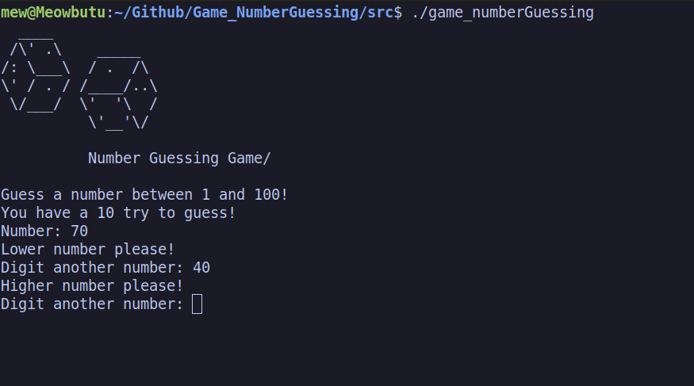

<h1 align="center">
 🎮 Number Guessing game in C
</h1>

<p align="center">
	<b><i> Just a game that generates random numbers. </i></b><br>
</p>

<p align="center">
	
	
	
</p>

## 💡 About the game:
A number guessing game is a simple guessing game where a user is supposed to guess a number between 0 and N in a maximum of 10 attempts. The game will end after 10 attempts and if the player failed to guess the number, and then player loses the game.

## 🛠️ Usage

The function is written in C language and this needs the **`gcc` compiler** and some standard **C libraries** to run in your terminal. <br>


### Instructions

Do you want see how this things works with your eyes? Download it.

**1. Cloning the repository**

To download the archives, run the command in your terminal :

```bash
# Clone the repository
$ git clone https://github.com/mewmewdevart/Game_NumberGuessing

# Enter into the directory
$ cd Game_NumberGuessing/src
```

**2. Run the code and play it**

Run the file, and play the game:

```bash
$ cd ./game_numberGuessing
```
## 🎮 Screen of Game

<p align="center">
  
</p>

<p align="center"> Developed with love 💜 by Larissa Cristina Benedito (Mewmew/Larcrist). </p>
